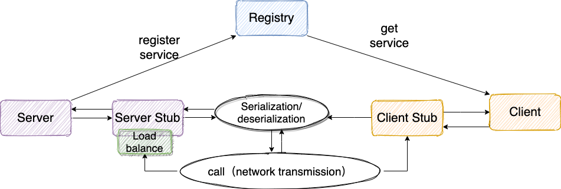

# RPC 项目学习实践

## RPC 原理
**RPC 模块**
  1. 客户端（服务消费端）：调用远程方法的一端。
  2. 客户端 Stub（桩）：这其实就是一代理类。代理类主要做的事情很简单，就是把你调用方法、类、方法参数等信息传递到服务端。
  3. 网络传输： 网络传输就是要把调用的方法的信息比如说参数这些东西传输到服务端，然后服务端执行完之后再把返回结果通过网络传输传输回来。网络传输的实现方式有很多种比如最近基本的 Socket 或者性能以及封装更加优秀的 Netty。
  4. 服务端 Stub（桩）：这个桩就不是代理类了。这里的服务端 Stub 实际指的就是接收到客户端执行方法的请求后，去指定对应的方法然后返回结果给客户端的类。
  5. 服务端（服务提供端）：提供远程方法的一端。

**RPC 调用流程**
  1. 服务消费端（client）以本地调用的方式调用远程服务；
  2. 客户端 Stub（client stub） 接收到调用后负责将方法、参数等组装成能够进行网络传输的消息体（序列化）：RpcRequest；
  3. 客户端 Stub（client stub） 找到远程服务的地址，并将消息发送到服务提供端；
  4. 服务端 Stub（桩）收到消息将消息反序列化为 Java 对象：RpcRequest；
  5. 服务端 Stub（桩）根据 RpcRequest 中的类、方法、方法参数等信息调用本地的方法；
  6. 服务端 Stub（桩）得到方法执行结果并将组装成能够进行网络传输的消息体：RpcResponse（序列化）发送至消费方；
  7. 客户端 Stub（client stub）接收到消息并将消息反序列化为 Java 对象：RpcResponse，这样也就得到了最终结果。
## RPC 框架

**最基本的 RPC 框架设计思路**

1. 注册中心：使用 Redis 实现。注册中心负责服务地址的注册与查找。服务端启动的时候将服务名称及其对应的地址 `(ip + port)` 注册到注册中心，服务消费端根据服务名称找到对应的服务地址。有了服务地址之后，服务消费端就可以通过网络请求服务端了。
2. 网络传输：使用 Socket 和 Netty 实现。调用远程的方法就要发请求，请求中至少要包含调用的类名、方法名以及相关参数！
3. 序列化：使用 Kyro 和 Hessian 实现。JDK 自带的序列化效率低并且有安全漏洞。比较常用的有 `hession2`、`kyro`、`protostuff`。
4. 动态代理：JDK 动态代理。因为 RPC 的主要目的就是让调用远程方法像调用本地方法一样简单，使用动态代理可以屏蔽远程方法调用的细节比如网络传输。当调用远程方法的时候，实际会通过代理对象来传输网络请求。
5. 负载均衡：实现一致性哈希和随机哈希。负载均衡就是为了避免单个服务器响应同一请求，容易造成服务器宕机、崩溃等问题。
6. ......